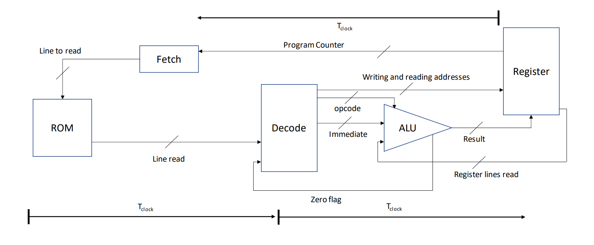

# Risc Elevator

This small project was created to test some concepts of computer architecture. It is a 8-bit system with 16 general-purpose registers and a 6 kbit ROM.

## Architecture

## Assembly to ALU Operations Mapping

The assembly instructions are translated into machine code, where the first three numbers (bits) of the machine code correspond to the operation code (`op`) of the ALU. All the machine code instructions have 24 bits (although the last bit is ommited in this prototype).

Operators **a** and **b** come from the registers, and operator **c** is an immediate coming from the machine code.

In **compilator.py**, the provided assembly mnemonics are translated into machine code. The syntax is as follows, in the following order:

`OPERATION [DESTINATION] [REGISTER_1] [REGISTER_2] [IMMEDIATE]`

The operands (between brackets) that are not required by the operation can be ignored.
E.g.: ADD R1 00001111

Here's a mapping of the assembly mnemonics to the ALU operations:

### 1. ADD

- **Machine Code Prefix**: `000`
- **Operands**: DESTINATION, REGISTER_1, IMMEDIATE
- **ALU Operation**: Addition (`a + c`)

### 2. SUB

- **Machine Code Prefix**: `001`
- **Operands**: DESTINATION, REGISTER_1, IMMEDIATE
- **ALU Operation**: Subtraction (`a - c`)

### 3. FLC

- **Machine Code Prefix**: `010`
- **Operands**: DESTINATION, REGISTER_1, REGISTER_2, IMMEDIATE
- **ALU Operation**: Custom operation to check the current floor was called.

### 4. MOV

- **Machine Code Prefix**: `011`
- **Operands**: DESTINATION, IMMEDIATE
- **ALU Operation**: Direct output of `c`.

### 5. CAE

- **Machine Code Prefix**: `100`
- **Operands**: DESTINATION, REGISTER_1, REGISTER_2
- **ALU Operation**: Custom operation to verify if a call is made on a floor above.

### 6. PASS

- **Machine Code Prefix**: `101`
- **Operands**: None
- **ALU Operation**: Direct output of `c`.

### 7. JMPZ

- **Machine Code Prefix**: `110` (in compilator: `110` and `101`)
- **Operands**: DESTINATION
- **ALU Operation**: Direct output of `c`.
  - Performs a conditional jump to `c` if the last ALU operation gave the result zero.
  - Note: it takes 3 clock cycles to perform the jump, therefore this function must always be followed by two PASS. The compilator does it automatically.

### 8. AND

- **Machine Code Prefix**: `111`
- **Operands**: DESTINATION, REGISTER_1, IMMEDIATE
- **ALU Operation**: Bitwise AND operation between `a` and `c`.

### 9. GOTO

- **Machine Code Prefix**: Multiple operations
- **Operands**: Label (as IMMEDIATE)
- **Operation**: Jump to a specified section of the code.

### 10. GOTOZ

- **Machine Code Prefix**: Multiple operations
- **Operands**: Label (as IMMEDIATE)
- **Operation**: Jump to a specified section of the code if the last ALU operation gave result zero.

> **Note**: The operations **GOTO** and **GOTOZ** involves a combination of operations and jumps in the machine code, so they don't directly map to a single ALU operation. Labels are marked by a line word ending in a colon (:).

## Compiling a software

The compiler accepts code in assembly. An example is given in input.txt

Usage: `python compiler.py [input_file]`

Default input file is `input.txt`. Output file is always `output.txt`.

To use the software, replace the corresponding lines in Rom.vhd
